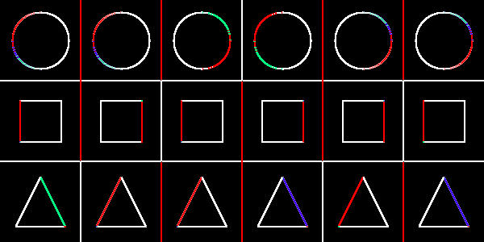

# OpenCV C++
The repository contains several labs and an individual task by image processing course from NUST MIS&S university.

## Lab 1 Sinusoidal circles
The goal of this lab is to draw sinusoids by each of RGB channels, you may see the result below.

## Lab 2 Brightness range
The goal of this lab is to make binary masks for different channels ranges in HSV color system. On the picture below:
- The first image is original
- The second image is red color binarization by hue
- The third image is binarization by highest values at saturation

## Lab 3 Contrast correction
The goal of this lab is to create contrast correction for the image by clipping highest and lowest values of contrast and equalizing other images by linear law. On the picture below:
- The first image is original in grayscale
- The second image is processed with clipped 20% of hisghest and lowest values

## Lab 4 Filters
The goal of this lab is to try different filters. On the picture below:
- The top left image is the original image in grayscale
- The top right image is an example of box filter with kernel 3x3
- The bottom left image is an example of applying linear filter with kernel [-0.5, 0.5] and equalization, which determinies vertical edges of objects
- The bottom right image is an example of applying median blur

## Lab 5 Test
This lab is a test work. First step is to create a grayscale image with all combinations of circle, rect and triangle with different colors and backgrounds.

The second step is to calculate derivatives at all directions of the previous image. On the image below all four derivatives are combined.

The third part is to create a colored picture, where absolute value of gradient is presented in value channel in HSV and two other channels are any two derivatives.

